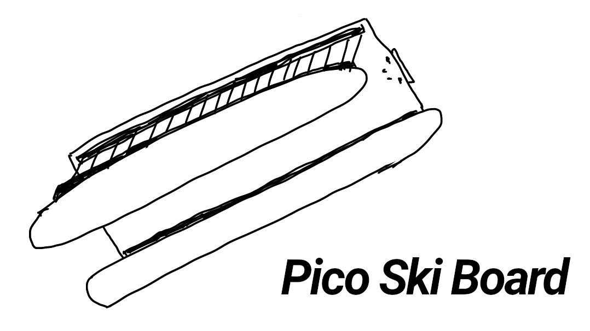
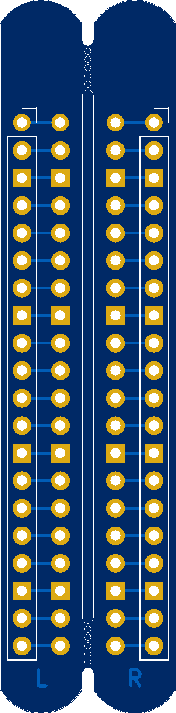
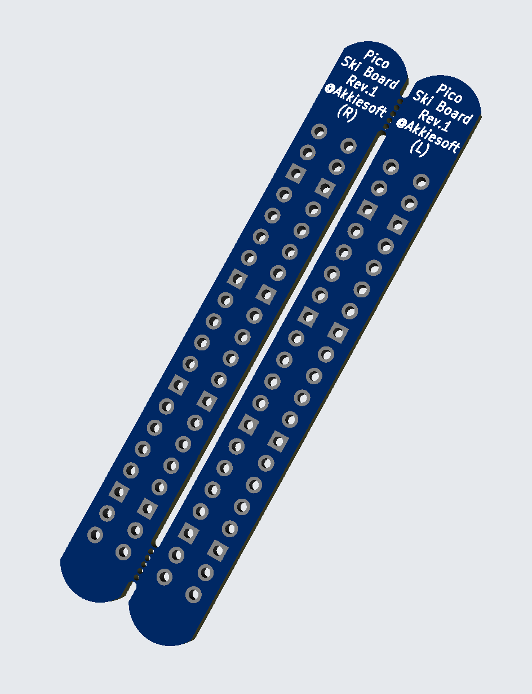
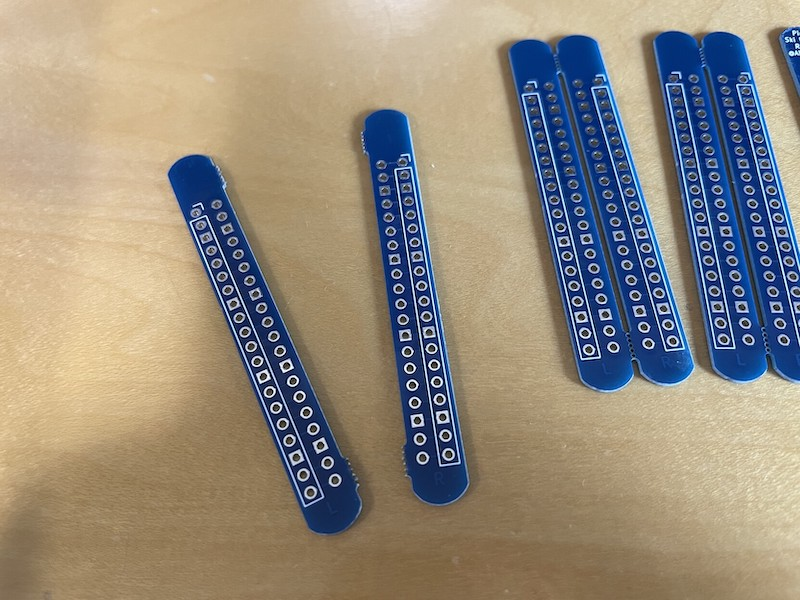
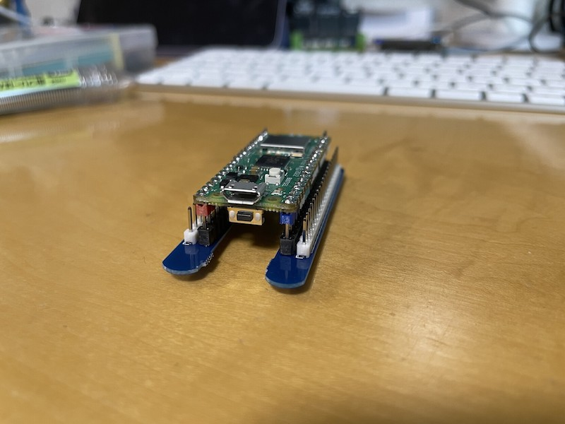

# Pico Ski Board

Pico Ski Board is the smallest breakout board for connecting a female pin header cable to the Raspberry Pi Pico without turning the Raspberry Pi Pico upside down.

To use, solder a 1x20 pin socket on the inside and a 1x20 pin header on the outside, and insert Raspberry Pi Pico into the pin socket.

## images

## How to order boards using garber data

* zip garber-rev1 directory
* Upload zip to [JLCPCB](https://jlcpcb.com/) and order.
    * NOTE: With this data, you cannot order for $2. To get it down to $2, you would have to remove one of the ski boards and order it as both left and right.

## To make it more of a ski board

If the pin sockets and pin headers could be surface mounted, it would make it more like a ski board. :)

## License

MIT License